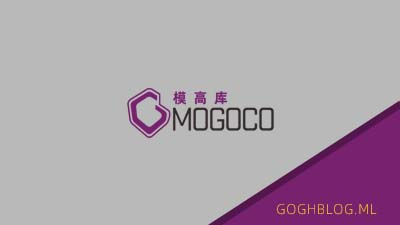

# MOGOCO For Typecho Theme
### 一个资源下载类型的Typecho主题

---
#### 主题预览：<a target="blank" href="http://mogoco.ml">http://mogoco.ml</a>
### 主题特点:
1. 简洁的flex响应式布局  
2. 纯css下拉菜单  
3. functions.php内增加下载功能，下载按钮内置在右侧边栏，发布文章的下面的字段中只需要添加下载地址即可。  
4. 右侧边栏增加评论展示与标签云
5. 底部友情链接
6. 
### 文件结构说明:
> |--- MOGOCO  
> |--- archive.php ---------------- 通用（分类、搜索、标签、作者）页面文件  
> |--- footer.php ----------------- 底部信息  
> |---functions.php ------------- 主题函数文件  
> |---header.php ----------------- 头部  
> |---index.php ------------------ 首页  
> |---page.php ------------------ 独立页面文件  
> |---post.php ------------------ 日志页面文件  
> |---Components ---------------- 组件文件夹  
>> |--- accordion.php ----------- 抽屉式菜单（左侧边栏）  
>> |--- breadcrumb.php -----------面包屑导航  
>> |--- cardbar.php  ------------ 卡片式内容展示  
>> |--- navbar.php  ------------- 导航栏   
>> |--- pagination.php ---------- 分页菜单  
>> |--- right-sidebar.php-------- 右侧边栏  
>> |--- similar.php -------------- 随机文章栏  
 
> |---img ------------------------ 图片文件夹  
>> |---logo.svg -------------------网站logo  

> |---css ------------------------ 样式表文件夹  
>> |---style.css ----------------- 基础样式  
>> |---Components.css ------------ 组件样式  

> |---screenshot.png ------------ 主题缩略图  

### 使用说明
:
